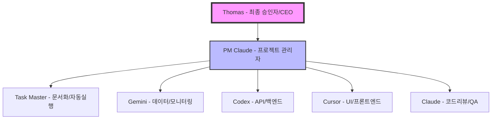

# 🏗️ AI Orchestra 협업 체계 및 거버넌스

> AI 팀 조직 구조, 역할, 의사결정 체계 정의
> Last Updated: 2025-08-21

## 🎯 조직 계층 구조



## 📊 역할 정의 (RACI Matrix)

| 역할 | Thomas | PM Claude | 팀원 AI | Task Master |
|------|--------|-----------|---------|-------------|
| **전략 결정** | A | R | I | I |
| **이슈 생성** | I | R | C | C |
| **작업 할당** | I | R | I | C |
| **작업 실행** | - | I | R | R |
| **중간 점검** | I | R | A | I |
| **결과 보고** | I | A | R | R |
| **문서화** | - | I | C | R |
| **품질 검증** | C | A | R | C |

- **R**: Responsible (실행 책임)
- **A**: Accountable (최종 책임)
- **C**: Consulted (협의 대상)
- **I**: Informed (정보 수신)

## 🔄 의사결정 프로세스

### Level 1: 자동 승인 (팀원 AI 권한)
- 단순 코드 수정
- 문서 업데이트
- 테스트 작성
- 버그 픽스

### Level 2: PM 승인 필요
- 새로운 기능 구현
- API 엔드포인트 추가
- 데이터베이스 스키마 변경
- 의존성 추가

### Level 3: Thomas 승인 필요
- 아키텍처 변경
- 새로운 AI 팀원 추가
- 외부 서비스 통합
- 상품화 전략 결정

## 🎭 팀원별 상세 역할

### 👑 Thomas (최종 승인자)
- **책임**: 전략적 방향 설정, 주요 의사결정
- **권한**: 모든 결정에 대한 최종 승인권
- **관여**: 마일스톤 검토, 블로커 해결

### 🎼 PM Claude (프로젝트 관리자)
- **책임**: 
  - GitHub Issue/PR 관리
  - 작업 분배 및 조율
  - 진행 상황 모니터링
  - Thomas에게 정기 보고
- **권한**: 
  - 작업 우선순위 조정
  - 팀원 작업 할당
  - 중간 승인 결정
- **도구**: GitHub CLI, 칸반보드, Task Master

### 🔧 팀원 AI (실행자)
#### Gemini (데이터 분석가)
- Rate limit 관리
- 데이터 수집/동기화
- 시스템 모니터링

#### Codex (백엔드 개발자)
- API 개발
- 데이터베이스 설계
- WebSocket 구현

#### Cursor (프론트엔드 개발자)
- UI 컴포넌트 개발
- 사용자 경험 최적화
- 실시간 데이터 표시

#### Claude (QA 엔지니어)
- 코드 리뷰
- 문서 검증
- 품질 보증

### 🤖 Task Master (자동화 전문가)
- **특별 역할**: 6번째 팀원
- **책임**:
  - 문서 자동 업데이트
  - 반복 작업 자동 실행
  - PRD 분석 및 작업 구조화
  - 프로토타입 빠른 생성
- **권한**: 자율 실행 모드에서 코드 직접 생성

## 📡 통신 채널

### 1차 채널: GitHub
- **Issues**: 작업 관리 중심
- **PR**: 코드 리뷰 및 병합
- **Projects**: 칸반보드 진행 추적
- **Discussions**: 아이디어 논의

### 2차 채널: 세션 자동화
- **iTerm2/tmux**: 세션 제어
- **AppleScript**: 메시지 전달
- **Allow System**: 자동 승인

### 3차 채널: 실시간 통신
- **WebSocket**: 대시보드 업데이트
- **File System**: 작업 감지
- **Webhook**: GitHub 이벤트

## 📈 성과 지표 (KPI)

### 팀 전체
- 작업 완료율: >90%
- 평균 응답 시간: <5분
- 블로커 해결 시간: <2시간

### PM Claude
- 이슈 처리 속도
- 작업 분배 효율성
- 보고 정확도

### 팀원 AI
- 작업 완료 시간
- 코드 품질 점수
- 재작업 비율

## 🚀 확장 로드맵

### Phase 1: 내부 도구 (현재)
- AI 팀 협업 최적화
- 프로세스 자동화
- 문서화 체계 구축

### Phase 2: 개발팀 전용
- 인간 개발자 통합
- CI/CD 파이프라인
- 코드 리뷰 자동화

### Phase 3: 타부서 확장
- 마케팅 팀 지원
- CS 팀 자동화
- 데이터 분석 팀

### Phase 4: SaaS 전환
- 멀티테넌시 구현
- PL Bot 통합
- 엔터프라이즈 기능
- 구독 모델

## 🔐 보안 및 권한

### 접근 권한
- **Thomas**: 전체 관리자
- **PM Claude**: 프로젝트 관리
- **팀원 AI**: 작업 실행
- **Task Master**: 문서/코드 생성

### Allow System 위험도
- **LOW**: 자동 승인
- **MEDIUM**: PM 검토
- **HIGH**: Thomas 승인

## 📋 일일 운영 플로우

```
06:00 - Task Master: 문서 자동 업데이트
09:00 - PM Claude: 스탠드업 & 작업 할당
09:30 - 팀원 AI: 작업 시작
12:00 - PM Claude: 중간 점검
15:00 - 팀원 AI: 진행 보고
17:00 - PM Claude: 일일 요약
18:00 - Task Master: 문서 최종 업데이트
```

## 🎯 핵심 원칙

1. **투명성**: 모든 작업은 GitHub에 기록
2. **자동화**: 반복 작업은 Task Master에게
3. **협업**: 팀원 간 상호 지원
4. **품질**: 코드 리뷰 필수
5. **속도**: 빠른 반복과 피드백

---

**이 문서는 AI Orchestra의 공식 거버넌스 문서입니다.**
*수정 권한: Thomas, PM Claude*