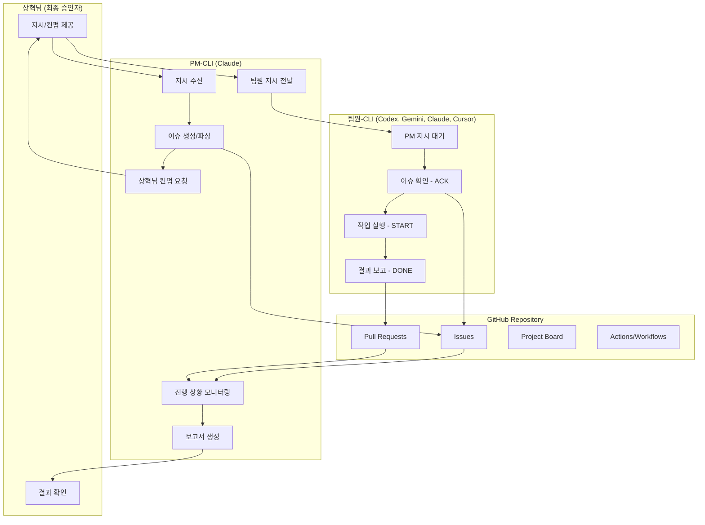

# 🎼 AI Orchestra 실행 알고리즘

## 실행 플로우

## 단계별 상세 설명

### 1. 지시 단계
- 상혁님 → PM: 작업 지시
- PM: 작업을 이슈로 분해
- PM → 상혁님: 이슈 계획 컨펌 요청

### 2. 실행 단계
- 상혁님: 컨펌
- PM → 팀원: 프롬프트로 지시 전달
- 팀원: GitHub 이슈 확인 및 작업 수행

### 3. 보고 단계
- 팀원 → GitHub: 코멘트 시그널 ([ACK], [START], [DONE])
- PM: GitHub 모니터링
- PM → 상혁님: 진행 상황 보고

### 4. 완료 단계
- 팀원: PR 생성 (Fixes #이슈번호)
- PM: 라운드 보고서 생성
- PM → 상혁님: 최종 보고

## 시그널 타이밍

| 시그널 | 발생 시점 | 제한 시간 |
|--------|----------|-----------|
| [ACK] | 이슈 확인 시 | 30분 이내 |
| [START] | 작업 시작 시 | ACK 후 즉시 |
| [REPORT] | 중간 보고 필요시 | 필요시 |
| [BLOCK] | 블로커 발생 시 | 즉시 |
| [DONE] | PR 생성 완료 시 | 작업 완료 즉시 |

## 권한 및 책임

### PM (Claude)
- 이슈 생성/관리
- 팀원 작업 지시
- 진행 상황 모니터링
- 상혁님 보고

### 팀원 (Codex, Gemini, Claude, Cursor)
- 지시받은 작업만 수행
- GitHub 이슈 코멘트로 보고
- PR 생성 및 테스트

### 상혁님
- 최종 의사결정
- 계획 승인
- 결과 검증