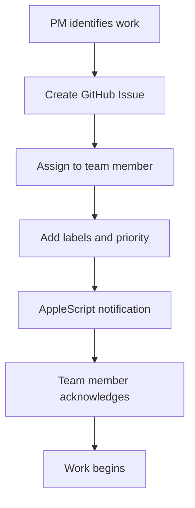

# 🤖 AI Team Operations Manual

## 📋 Table of Contents
1. [Team Overview](#-team-overview)
2. [Member Profiles](#-member-profiles)
3. [Communication Protocols](#-communication-protocols)
4. [Task Assignment Workflow](#-task-assignment-workflow)
5. [Progress Reporting](#-progress-reporting)
6. [Blocker Escalation](#-blocker-escalation)
7. [GitHub Integration](#-github-integration)
8. [Performance Standards](#-performance-standards)

---

## 🎭 Team Overview

### Mission Statement
The AI Orchestra team operates as a unified development unit, leveraging specialized AI capabilities to deliver high-quality software solutions through coordinated collaboration and automated workflows.

### Core Principles
- **Transparency**: All work visible through GitHub Issues
- **Accountability**: Regular progress reporting every 30 minutes
- **Collaboration**: Cross-functional support and knowledge sharing
- **Excellence**: High-quality deliverables with proper testing
- **Automation**: Streamlined workflows reducing manual overhead

---

## 👥 Member Profiles

### 🔹 Gemini (Data Specialist)
- **Environment**: iTerm Tab 4, Session 2
- **Specializations**: 
  - GitHub API integration
  - Data collection and processing
  - Rate limiting and optimization
  - Real-time synchronization systems
- **Communication**: Shell mode ($) ↔ AI mode (>) via `!` command
- **Strengths**: Large-scale data processing, API optimization
- **Current Focus**: GitHub data pipeline architecture

### 🔸 Codex (Backend Engineer)
- **Environment**: iTerm Tab 4, Session 4
- **Specializations**:
  - FastAPI backend development
  - Database design and optimization
  - WebSocket implementation
  - Authentication and security
- **Communication**: Direct AI mode interaction
- **Strengths**: Clean architecture, performant APIs
- **Current Focus**: Backend infrastructure and real-time features

### 🔷 VSCode Claude (Frontend Developer)
- **Environment**: VSCode with Claude extension
- **Specializations**:
  - React/Next.js development
  - Component architecture
  - UI/UX implementation
  - Real-time frontend features
- **Communication**: VSCode extension interface
- **Strengths**: Modern frontend patterns, responsive design
- **Current Focus**: Dashboard UI and real-time data visualization

### 🔶 Cursor ChatGPT (UX/UI Designer)
- **Environment**: Cursor Editor with ChatGPT integration
- **Specializations**:
  - Design system development
  - User experience optimization
  - Component design
  - Accessibility compliance
- **Communication**: Cmd+K AI Chat interface
- **Strengths**: Human-centered design, visual consistency
- **Current Focus**: Design system refinement and user flow optimization

### 🔺 PM Claude (Project Manager)
- **Environment**: Terminal with GitHub CLI
- **Responsibilities**:
  - Task coordination and assignment
  - Progress monitoring and reporting
  - Blocker resolution
  - Stakeholder communication
- **Authority**: Task reassignment, timeline adjustments
- **Tools**: GitHub CLI, AppleScript automation, monitoring systems

---

## 📡 Communication Protocols

### 1. Primary Communication Channel
**GitHub Issues Comments** - All official team communication

```bash
# Standard comment format
gh issue comment [issue-number] -R ihw33/ai-orchestra-dashboard --body "[Member-Name] [Status-Icon] [Message]"
```

### 2. Status Icons Reference
- 🚀 **Starting**: Beginning new task
- ⚙️ **Working**: Regular progress update
- 🔄 **Testing**: Testing/validation phase
- 🚨 **Blocked**: Issue requiring assistance
- ✅ **Complete**: Task finished
- 💡 **Update**: Status change or important information

### 3. AppleScript Integration

#### iTerm Team Members (Gemini, Codex)
```applescript
# Notification delivery
tell application "iTerm2"
    tell session [session-number] of tab 4 of current window
        write text "[message]"
        delay 0.5
        write text ""  # Send enter key
    end tell
end tell
```

#### Cursor Communication
```applescript
# Open AI Chat and send message
tell application "Cursor"
    activate
    delay 0.5
    key code 11 using {command down}  # Cmd+K
    delay 1
    type "[message]"
    key code 36  # Enter
end tell
```

### 4. Session Management

#### Gemini Mode Switching
```bash
# Current mode detection
echo $PS1  # Shows $ (shell) or > (AI)

# Switch to AI mode
!

# Switch to Shell mode  
!
```

#### Session Identification
```bash
# List all iTerm sessions
osascript -e 'tell application "iTerm2" to get name of every session of tab 4'

# Session naming convention
# Session 1: "Claude-AI"
# Session 2: "Gemini-Data" 
# Session 4: "Codex-Backend"
```

---

## 📋 Task Assignment Workflow

### 1. Task Creation Process



### 2. Issue Labels System

| Label | Meaning | Usage |
|-------|---------|-------|
| `p0` | Critical/Urgent | Must complete today |
| `p1` | High Priority | Complete this sprint |
| `p2` | Medium Priority | Complete when possible |
| `frontend` | Frontend work | VSCode Claude |
| `backend` | Backend work | Codex |
| `data` | Data/API work | Gemini |
| `design` | Design work | Cursor ChatGPT |
| `round-2` | Current sprint | All active tasks |
| `blocked` | Cannot proceed | Needs assistance |

### 3. Assignment Criteria

#### Task-Member Matching
- **API/Data Tasks** → Gemini
- **Backend/Database** → Codex  
- **Frontend/UI** → VSCode Claude
- **Design/UX** → Cursor ChatGPT

#### Workload Balancing
- Maximum 3 active tasks per member
- No more than 1 P0 task per member
- Consider current progress and complexity

### 4. Handoff Procedures
```bash
# Completing prerequisites
gh issue comment [issue-number] --body "[Member] ✅ Prerequisites complete for #[next-issue]"

# Ready for handoff
gh issue comment [issue-number] --body "[Member] 🔄 Ready for handoff to @[next-member]"

# Accepting handoff
gh issue comment [issue-number] --body "[Member] 🚀 Handoff accepted, beginning work"
```

---

## 📊 Progress Reporting

### 1. Reporting Schedule

| Frequency | Trigger | Required Content |
|-----------|---------|------------------|
| **Immediate** | Task received | Acknowledgment + ETA |
| **Every 30 min** | During work | Progress % + current activity |
| **Immediate** | Blocker hit | Problem description + help needed |
| **Task complete** | Work finished | Results + deliverables + testing |

### 2. Progress Report Templates

#### Standard Progress Update
```bash
gh issue comment [issue-number] --body "[Member] ⚙️ Progress: [X]%
- ✅ Completed: [specific items]
- 🔄 Current: [what you're doing now]
- 📋 Next: [what's coming next]
- ⏱️ ETA: [estimated completion time]"
```

#### Completion Report
```bash
gh issue comment [issue-number] --body "[Member] ✅ Task Complete
- 📁 Deliverables: [file paths]
- 🧪 Testing: [test results]
- 📝 Notes: [important details]
- 🔄 Ready for: [next phase/person]"
```

#### Blocker Report
```bash
gh issue comment [issue-number] --body "[Member] 🚨 BLOCKER
- ❌ Problem: [clear description]
- 🎯 Impact: [what's affected]
- 🆘 Need: [specific help required]
- ⏰ Urgency: [timeline impact]
@PM-Claude"
```

### 3. Progress Tracking Automation

#### File Monitoring
```bash
# Check for recent changes
find /Users/m4_macbook/Projects/ai-orchestra-dashboard -name "*.py" -o -name "*.ts" -o -name "*.tsx" -mmin -30

# Automated progress detection
git diff --name-only HEAD~1 HEAD
```

#### Activity Verification
```bash
# Last commit activity
git log --oneline --since="30 minutes ago" --author="[member-email]"

# Last issue comment
gh issue view [issue-number] --comments | tail -5
```

---

## 🚨 Blocker Escalation

### 1. Escalation Levels

| Level | Response Time | Escalation Actions |
|-------|---------------|-------------------|
| **Level 1** | 5 minutes | PM notification, alternative approaches |
| **Level 2** | 15 minutes | Task reassignment, additional resources |
| **Level 3** | 30 minutes | Sprint scope adjustment, stakeholder notification |

### 2. Common Blocker Types

#### Technical Blockers
- **API Rate Limits**: Switch to batch processing, implement caching
- **Dependency Issues**: Version conflicts, missing packages
- **Authentication Problems**: Token expiry, permission issues
- **Environment Issues**: Port conflicts, service unavailability

#### Process Blockers
- **Unclear Requirements**: Request clarification from PM
- **Missing Dependencies**: Coordinate with other team members
- **Resource Conflicts**: File locks, merge conflicts
- **Knowledge Gaps**: Request documentation or mentoring

### 3. Resolution Procedures

#### Self-Resolution (Try First)
```bash
# Check documentation
cd /Users/m4_macbook/Projects/ai-orchestra-dashboard/docs
grep -r "[topic]" .

# Check similar issues
gh issue list -R ihw33/ai-orchestra-dashboard --search "[keywords]"

# Check recent solutions
gh issue list -R ihw33/ai-orchestra-dashboard --state closed --label "resolved"
```

#### Escalation Process
```bash
# Step 1: Document the blocker
gh issue comment [issue-number] --body "[Member] 🚨 BLOCKER: [detailed description]"

# Step 2: Tag PM for assistance  
gh issue comment [issue-number] --body "@PM-Claude urgent assistance needed"

# Step 3: Continue with non-blocked work
gh issue comment [issue-number] --body "[Member] 🔄 Working on non-blocked portions while waiting"
```

---

## 🔗 GitHub Integration

### 1. Required GitHub CLI Setup

```bash
# Authentication check
gh auth status

# Repository context
gh repo set-default ihw33/ai-orchestra-dashboard

# Issue management
gh issue list --assignee @me
gh issue view [number] --comments
gh issue comment [number] --body "[message]"
```

### 2. Automated Workflows

#### Issue Lifecycle Management
```bash
# Auto-assignment based on labels
gh issue edit [number] --add-assignee "[member-github-username]"

# Label management
gh issue edit [number] --add-label "in-progress"
gh issue edit [number] --remove-label "todo"

# Status tracking
gh issue close [number] --comment "Completed by [member]"
```

#### Integration with Development

```bash
# Link commits to issues
git commit -m "fix: resolve issue #[number] - [description]"

# Create PR from issue
gh pr create --title "Fix #[number]: [title]" --body "Closes #[number]"

# Update issue from PR
gh pr comment [pr-number] --body "Updates #[issue-number]"
```

### 3. Automated Monitoring

#### Progress Extraction
```python
# Extract progress from comments
import re
comment_text = gh_issue_comments[latest]
progress_match = re.search(r'Progress:\s*(\d+)%', comment_text)
current_progress = int(progress_match.group(1)) if progress_match else 0
```

#### Team Status Dashboard
```python
# Real-time team status
team_status = {
    'gemini': extract_latest_status('gemini'),
    'codex': extract_latest_status('codex'), 
    'vscode-claude': extract_latest_status('vscode-claude'),
    'cursor-chatgpt': extract_latest_status('cursor-chatgpt')
}
```

---

## 📈 Performance Standards

### 1. Response Time Requirements

| Action | Maximum Time | Monitoring Method |
|--------|-------------|-------------------|
| Issue Acknowledgment | 5 minutes | GitHub API timestamp |
| Progress Reports | 30 minutes | Automated comment analysis |
| Blocker Reporting | Immediate | Real-time detection |
| Task Completion | As estimated | Sprint tracking |

### 2. Quality Standards

#### Code Quality
- All code must pass existing lints/tests
- Follow established patterns in codebase
- Include appropriate error handling
- Document complex logic with comments

#### Communication Quality
- Clear, specific progress descriptions
- Accurate progress percentages
- Proactive blocker reporting
- Professional, constructive tone

#### Deliverable Quality
- Working code that meets requirements
- Appropriate test coverage
- Documentation for complex features
- Proper integration with existing systems

### 3. Team Performance Metrics

#### Individual Metrics
- **Task Completion Rate**: Target >95%
- **On-time Delivery**: Target >90%
- **Communication Compliance**: Target 100%
- **Quality Score**: Based on code review feedback

#### Team Metrics
- **Sprint Velocity**: Tasks completed per sprint
- **Cycle Time**: Average time from task start to completion
- **Defect Rate**: Issues requiring rework
- **Collaboration Score**: Cross-team assistance and knowledge sharing

---

## 🛠️ Tools and Environment

### 1. Required Software

| Tool | Purpose | Installation |
|------|---------|-------------|
| GitHub CLI | Issue management | `brew install gh` |
| iTerm2 | Terminal environment | Download from website |
| Node.js 18+ | Frontend development | `brew install node` |
| Python 3.10+ | Backend development | `brew install python` |
| VSCode | Code editing | Download from website |
| Cursor | AI-powered editing | Download from website |

### 2. Environment Variables

```bash
# Required environment setup
export GITHUB_TOKEN="[your-token]"
export PROJECT_ROOT="/Users/m4_macbook/Projects/ai-orchestra-dashboard"
export TEAM_MEMBER="[your-member-name]"
```

### 3. Directory Structure

```
ai-orchestra-dashboard/
├── docs/                    # Documentation (this manual)
├── frontend/               # Next.js application  
├── backend/               # FastAPI server
├── scripts/               # Automation scripts
│   ├── notify_*.applescript  # Team communication
│   └── monitor_*.sh         # Progress monitoring  
└── workflow/              # Process automation
```

---

## 🚀 Quick Start Checklist

### For New Team Members
- [ ] Verify GitHub CLI authentication
- [ ] Navigate to project directory
- [ ] Check assigned issues
- [ ] Send acknowledgment comment
- [ ] Set up development environment
- [ ] Review current sprint goals
- [ ] Introduce yourself to the team

### For Each Work Session
- [ ] Check for new assignments
- [ ] Review issue requirements
- [ ] Acknowledge task receipt
- [ ] Begin work with start comment
- [ ] Set 30-minute reminder for progress update
- [ ] Monitor for blockers proactively
- [ ] Submit completion report when done

---

**📅 Last Updated**: August 21, 2025  
**🔄 Next Review**: Weekly team retrospective  
**📝 Maintained by**: Documentation AI (Task Master)  
**✅ Approved by**: PM Claude & Thomas