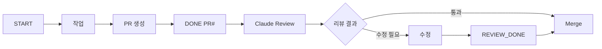

# 🔍 Code Review Process with Claude Code Agent

## 개요
모든 PR은 Claude Code Agent의 자동 코드 리뷰를 거쳐야 합니다.

## 프로세스

### 1. PR 생성 후
```
팀원: [DONE] PR #XX
```

### 2. Claude Code Agent 리뷰
PM이 Claude Code (Tab 4)에 전달:
```
@agent code-reviewer
PR URL: https://github.com/ihw33/ai-orchestra-dashboard/pull/XX
```

### 3. 리뷰 항목
- ✅ 코드 품질
- ✅ 보안 취약점
- ✅ 성능 이슈
- ✅ 테스트 커버리지
- ✅ 문서화
- ✅ 코딩 컨벤션

### 4. 리뷰 결과 처리
```markdown
## Code Review by Claude Code Agent

### ✅ Good
- 명확한 함수명
- 적절한 에러 처리

### 🔧 Needs Improvement
1. Line 25: SQL Injection 가능성
2. Line 45: 하드코딩된 값
3. Missing: 단위 테스트

### 📝 Suggestions
- config 파일로 분리 추천
- 타입 힌트 추가
```

### 5. 수정 및 재검토
```
팀원: 리뷰 반영 → 커밋 추가
팀원: [REVIEW_DONE]
PM: 최종 확인 → 머지
```

## 시그널 흐름


## 예외 상황
- 긴급 핫픽스: 리뷰 생략 가능 (PM 판단)
- 문서만 수정: 간소화 리뷰
- 테스트 코드: 기본 리뷰만

## Claude Code Agent 설정
```json
// .claude/agents.json
{
  "code-reviewer": {
    "description": "Restrict Claude to read-only operations for code review",
    "permissions": {
      "allow": ["Read(**/*)", "Glob", "Grep", "LS"],
      "deny": ["Edit", "Write", "MultiEdit", "Bash", "WebFetch"]
    }
  }
}
```

### 사용 방법
```bash
# Claude Code에서 (Tab 4)
@agent code-reviewer

# PR 리뷰 요청
Review PR: https://github.com/ihw33/ai-orchestra-dashboard/pull/XX
```