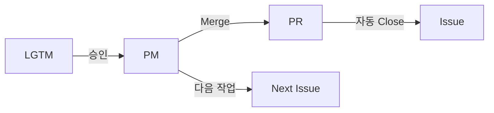

# 🎼 AI Orchestra Complete Workflow

## 1. 팀 구성
- **PM**: Claude (Terminal) - 전체 조율 및 관리
- **Backend**: Codex (Tab 2) - API, 서버 구현
- **Data**: Gemini (Tab 3) - 데이터 수집, 처리
- **Frontend**: VSCode Claude - UI 구현
- **Design**: Cursor ChatGPT - 디자인 시스템
- **Reviewer**: Claude Code (Tab 4) - 코드 리뷰 전담

## 2. 프로세스 흐름

### 2.1 작업 시작
```mermaid
graph LR
    PM[PM Claude] -->|Issue 지시| Team[팀원 CLI]
    Team -->|[ACK]| Issue[GitHub Issue]
    Team -->|[START]| Work[작업 수행]
```

### 2.2 PR 생성 및 리뷰
```mermaid
graph LR
    Work[작업 완료] -->|PR 생성| PR[Pull Request]
    Team -->|[DONE] PR#| Issue
    PM -->|리뷰 요청| Reviewer[Claude Code]
    Reviewer -->|리뷰 결과| PR
```

### 2.3 수정 사이클
```mermaid
graph LR
    Review[리뷰 결과] -->|수정 필요| PM
    PM -->|수정 지시| Team
    Team -->|수정| PR
    Team -->|[REVIEW_DONE]| Issue
    PM -->|재리뷰| Reviewer
```

### 2.4 완료


## 3. 시그널 체계

| 시그널 | 의미 | 위치 | 타이밍 |
|--------|------|------|--------|
| [ACK] | 작업 확인 | Issue 코멘트 | 지시 받은 후 30분 이내 |
| [START] | 작업 시작 | Issue 코멘트 | ACK 직후 |
| [REPORT] | 중간 보고 | Issue 코멘트 | 필요시 |
| [BLOCK] | 블로커 발생 | Issue 코멘트 | 즉시 |
| [DONE] PR# | 작업 완료 | Issue 코멘트 | PR 생성 후 |
| [REVIEW_DONE] | 리뷰 반영 완료 | Issue 코멘트 | 수정 후 |

## 4. GitHub 구조

### 4.1 Issue
- 작업 정의 및 지시
- 진행 상황 추적 (시그널)
- 완료 기준 명시

### 4.2 Pull Request
- 코드 제출
- 리뷰 및 피드백
- `Fixes #이슈번호` 필수

### 4.3 Project Board
- 전체 진행 상황 시각화
- Status: Todo → In Progress → Done
- Priority, Round, Phase 필드

## 5. 자동화 도구

### 5.1 GitHub Actions
```yaml
validate-pr-link.yml    # PR에 Fixes # 검증
done-comment-guard.yml  # [DONE]에 PR# 검증
round-report.yml        # 라운드 보고서 생성
```

### 5.2 Claude Code Agent
```json
{
  "code-reviewer": {
    "permissions": {
      "allow": ["Read", "Glob", "Grep", "LS"],
      "deny": ["Edit", "Write", "Bash", "WebFetch"]
    }
  }
}
```

### 5.3 AppleScript 자동화
- 팀원 간 통신
- 리뷰 요청 전송
- 수정 지시 전달

## 6. 작업 우선순위

### Round 2 Phase 구조
```
Phase 1 (P0): API 연결 기반
  ├── #25: GitHub 토큰 설정 ← 현재
  ├── #26: API 클라이언트 인증
  └── #27: Rate limit 처리

Phase 2 (P1): 데이터 수집
  ├── #28: Repository 메타데이터
  ├── #29: Issues 동기화
  └── #30: PR 동기화

Phase 3 (P1/P2): 데이터 처리
  ├── #31: 데이터 정규화
  └── #32: WebSocket

Phase 4 (P1): UI 통합
  ├── #33: 대시보드 API 연동
  └── #34: 실시간 데이터 표시
```

## 7. 팀원별 CLI 접근

### Codex (Tab 2)
```bash
# 자신의 작업 확인
gh issue list -R ihw33/ai-orchestra-dashboard --label "codex"

# 작업 시작
gh issue comment [번호] -R ihw33/ai-orchestra-dashboard --body "[START]"

# PR 생성
gh pr create --title "[Issue #X]" --body "Fixes #X"
```

### Gemini (Tab 3)
```bash
# Shell 모드 전환
!  # AI 모드로 전환

# 작업 확인
gh issue view [번호] -R ihw33/ai-orchestra-dashboard
```

### Claude Code (Tab 4)
```bash
@agent code-reviewer

# PR 리뷰
Review PR: [URL]

# 리뷰 결과 전송
gh pr comment [번호] -R ihw33/ai-orchestra-dashboard --body "Review"
```

## 8. 문제 해결

### 일반적인 문제
| 문제 | 원인 | 해결 |
|------|------|------|
| 통신 실패 | CLI 모드 오류 | GitHub Issue 사용 |
| PR 링크 없음 | Fixes # 누락 | PR 수정 |
| 리뷰 지연 | Agent 미응답 | 수동 리뷰 |

## 9. 성공 지표

- Issue 완료율: 90% 이상
- 평균 작업 시간: 2시간 이내
- 리뷰 사이클: 3회 이내
- 블로커 발생률: 15% 이하

## 10. 현재 상태 (2025-08-20)

### Round 1: ✅ 완료
- 13개 이슈 중 10개 완료 (77%)
- Backend, Frontend, Data, Design 기초 구축

### Round 2: 🚧 진행 중
- Issue #25: PR #35 리뷰 대기 중
- 다음: Issue #26-34

---

**마지막 업데이트**: 2025-08-20
**작성자**: PM Claude
**버전**: 1.0