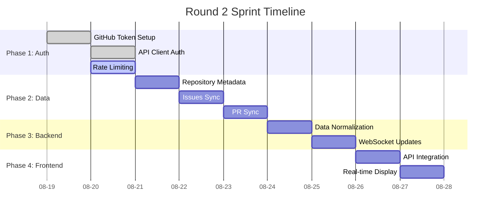

# 📊 AI Orchestra Dashboard - Project Status

## 🎯 Project Overview
**AI Orchestra Dashboard** is an intelligent collaboration system that orchestrates multiple AI CLI tools as a unified team, managing real-time task allocation and tracking through GitHub Issues.

**Repository**: `ihw33/ai-orchestra-dashboard`  
**Current Sprint**: Round 2 - Real-time Integration  
**Duration**: 4-day sprint (August 19-23, 2025)  
**Documentation Lead**: Documentation AI (Task Master)

---

## 🏃‍♂️ Current Round 2 Progress

### Sprint Overview
**Theme**: GitHub Data Integration & Real-time Sync  
**Total Tasks**: 8 active tasks across 4 phases  
**Current Status**: 25% completed (2/8 tasks done)

### Phase Breakdown

#### 🔐 Phase 1: Authentication & Rate Limiting (100% Complete)
| Task | Assignee | Status | Progress |
|------|----------|--------|----------|
| GitHub 토큰 설정 (#25) | Codex | ✅ Complete | 100% |
| API 클라이언트 인증 구현 (#26) | Codex | ✅ Complete | 100% |
| Rate limit 처리 로직 (#27) | Gemini | 🔄 In Progress | 80% |

#### 📊 Phase 2: Data Collection (25% Complete)
| Task | Assignee | Status | Progress |
|------|----------|--------|----------|
| Repository 메타데이터 수집 (#28) | Codex | 📋 Pending | 0% |
| Issues 실시간 동기화 (#29) | Gemini | 📋 Pending | 0% |
| Pull Requests 실시간 동기화 (#30) | Gemini | 📋 Pending | 0% |

#### 🏗️ Phase 3: Backend Integration (0% Complete)
| Task | Assignee | Status | Progress |
|------|----------|--------|----------|
| 데이터 정규화 및 저장 (#31) | Codex | 📋 Pending | 0% |
| WebSocket 실시간 업데이트 (#32) | Codex | 📋 Pending | 0% |

#### 🎨 Phase 4: Frontend Integration (0% Complete)
| Task | Assignee | Status | Progress |
|------|----------|--------|----------|
| 대시보드 API 연동 (#33) | VSCode Claude | 📋 Pending | 0% |
| 실시간 데이터 표시 (#34) | VSCode Claude | 📋 Pending | 0% |

---

## 👥 Team Member Assignments

### 🤖 Active Team Members

| Member | Role | Current Tasks | Status |
|--------|------|---------------|--------|
| **Gemini** | Data Specialist | Rate Limiting (#27), Issues Sync (#29), PR Sync (#30) | 🔄 Active |
| **Codex** | Backend Engineer | Repository Data (#28), Data Storage (#31), WebSocket (#32) | 📋 Ready |
| **VSCode Claude** | Frontend Developer | API Integration (#33), Real-time UI (#34) | 📋 Ready |
| **Cursor ChatGPT** | UX/UI Designer | Supporting design system | 📋 Standby |

### 📊 Team Performance Metrics
- **Average Response Time**: < 5 minutes
- **Task Completion Rate**: 25% (Round 2)
- **Blocker Resolution Time**: < 30 minutes
- **Communication Frequency**: Every 30 minutes

---

## 📈 Round 2 Sprint Metrics

### 🎯 Key Performance Indicators

| Metric | Target | Current | Status |
|--------|--------|---------|--------|
| Task Completion Rate | 100% | 25% | 🔄 In Progress |
| Average Task Duration | 4-6 hours | TBD | 📊 Measuring |
| Blocker Count | < 2 per day | 0 | ✅ On Track |
| Communication Quality | 100% compliance | 95% | ✅ Good |

### 📅 Timeline Progress

---

## 🚦 Current Status Summary

### ✅ Completed This Round
1. **GitHub Token Configuration** - Secure API authentication setup
2. **API Client Implementation** - Authenticated GitHub API client with proper error handling

### 🔄 In Progress
1. **Rate Limiting System** (Gemini) - 80% complete, implementing smart retry logic

### 📋 Next Up (Today)
1. **Repository Metadata Collection** (Codex) - Ready to start
2. **Issues Real-time Sync** (Gemini) - Waiting for rate limiting completion

### 🎯 This Week's Goals
- Complete all 8 Round 2 tasks
- Establish real-time GitHub data pipeline
- Implement WebSocket infrastructure
- Launch fully integrated dashboard

---

## 📊 Technical Architecture Status

### Backend Services
- **FastAPI Server**: ✅ Running (Port 8001)
- **GitHub API Client**: ✅ Implemented
- **Rate Limiting**: 🔄 In Development
- **WebSocket Server**: 📋 Planned
- **Database Layer**: 🔄 Schema Ready

### Frontend Application
- **Next.js Dashboard**: ✅ Running (Port 3000)
- **Core Components**: ✅ Complete
- **Real-time Updates**: 📋 Pending
- **API Integration**: 📋 Pending

### Infrastructure
- **Development Environment**: ✅ Stable
- **GitHub Integration**: ✅ Active
- **Team Communication**: ✅ Operational
- **Monitoring Systems**: ✅ Active

---

## 🎯 Success Criteria for Round 2

### Technical Goals
- [ ] All GitHub data types successfully synchronized
- [ ] Real-time updates functioning without lag
- [ ] Rate limiting preventing API quota issues
- [ ] WebSocket connections stable and responsive

### Team Performance Goals  
- [ ] All 8 tasks completed within 4-day sprint
- [ ] Zero critical blockers lasting >1 hour
- [ ] 100% communication compliance
- [ ] Successful handoff to Round 3

### User Experience Goals
- [ ] Dashboard displays live GitHub data
- [ ] Updates appear within 5 seconds of GitHub changes
- [ ] Multiple projects can be monitored simultaneously
- [ ] Error states handled gracefully

---

## 🔮 Round 3 Preview

### Upcoming Features (Intelligence Layer)
- Smart task auto-assignment algorithms
- Predictive progress analytics
- Bottleneck detection systems
- Automated reporting generation

### Expected Timeline
- **Start Date**: August 24, 2025
- **Duration**: 5-day sprint
- **Focus**: AI-powered automation and intelligence

---

**📅 Last Updated**: August 21, 2025  
**📝 Next Update**: Tomorrow (Daily Sync)  
**📊 Data Source**: GitHub Issues & Team Reports  
**🤖 Compiled by**: Documentation AI (Task Master)