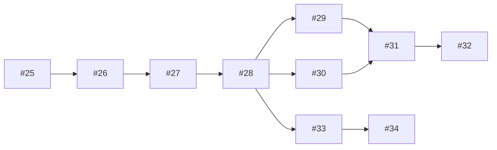

# 📊 Round 2 작업 현황 (2025-08-19)

## 🎯 팀원별 작업 할당

### Codex (5개 작업)
- [ ] #25: GitHub 토큰 설정 (P0) - **시작 필요**
- [ ] #26: API 클라이언트 인증 (P0) - 대기 (#25 완료 후)
- [ ] #28: Repository 메타데이터 (P1) - 대기
- [ ] #31: 데이터 정규화 (P1) - 대기
- [ ] #32: WebSocket (P2) - 대기

### Gemini (3개 작업)
- [ ] #27: Rate limit 처리 (P0) - 대기 (#26 완료 후)
- [ ] #29: Issues 동기화 (P1) - 대기
- [ ] #30: PR 동기화 (P1) - 대기

### VSCode Claude (2개 작업)
- [ ] #33: 대시보드 API 연동 (P1) - 대기 (#28 완료 후)
- [ ] #34: 실시간 데이터 표시 (P1) - 대기

## 📈 진행 상태
```
전체: 0/10 (0%)
P0 (긴급): 0/3 (0%)
P1 (높음): 0/6 (0%)
P2 (보통): 0/1 (0%)
```

## 🔄 작업 순서


## 📝 시그널 로그
- [대기중] 모든 작업 시작 전

---
*이 파일은 PM이 수동으로 업데이트합니다*
