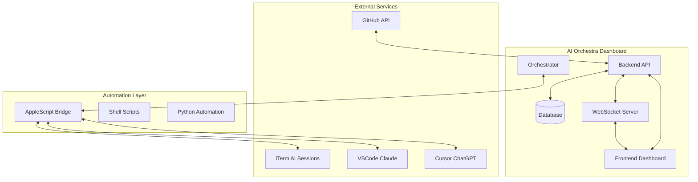
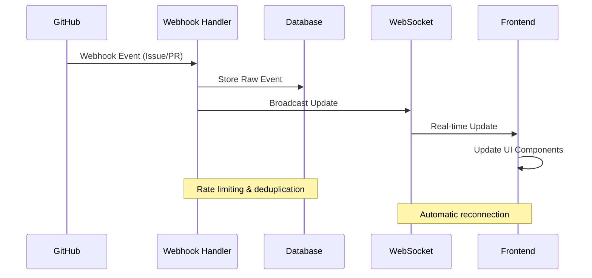
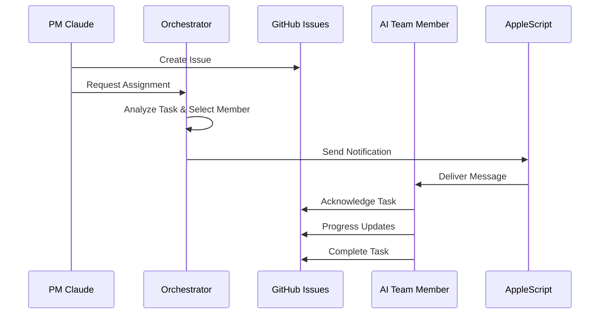
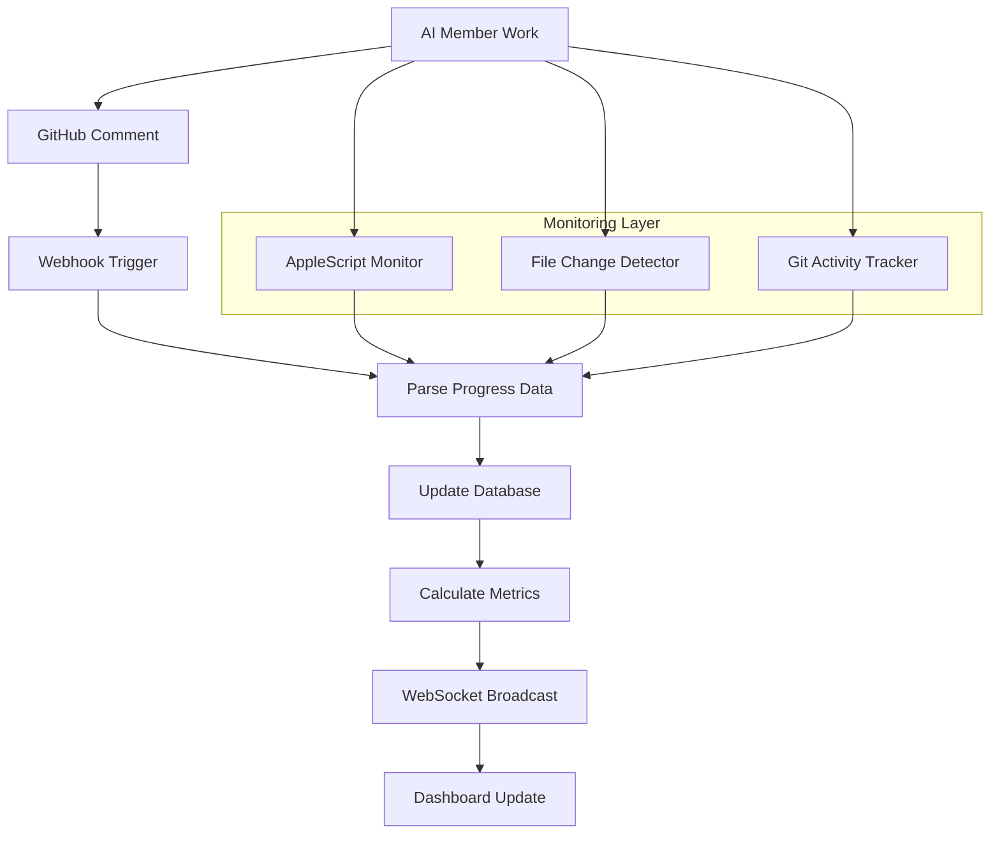
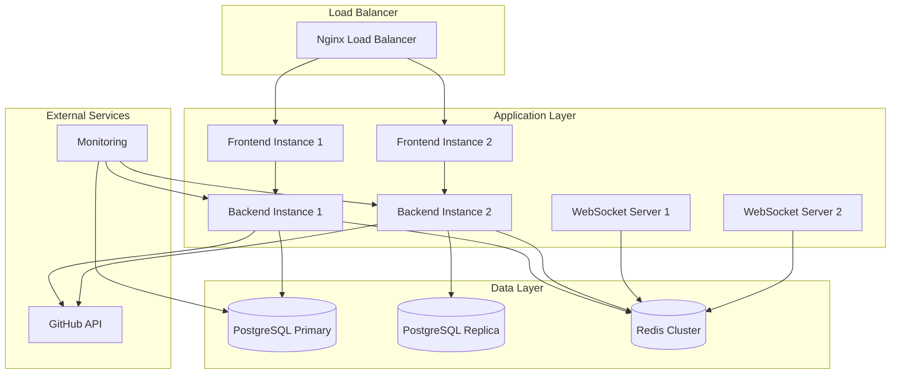

# 🏗️ Technical Architecture Document

## 📋 Table of Contents
1. [System Overview](#-system-overview)
2. [Component Architecture](#-component-architecture)
3. [API Design](#-api-design)
4. [Data Flow](#-data-flow)
5. [GitHub Integration](#-github-integration)
6. [Real-time Communication](#-real-time-communication)
7. [Database Schema](#-database-schema)
8. [Security Considerations](#-security-considerations)
9. [Deployment Architecture](#-deployment-architecture)

---

## 🎯 System Overview

### Architecture Philosophy
The AI Orchestra Dashboard follows a **microservices-inspired architecture** with clear separation of concerns, real-time data synchronization, and scalable team orchestration capabilities.

### Core Technologies

| Component | Technology | Version | Purpose |
|-----------|------------|---------|---------|
| **Frontend** | Next.js + TypeScript | 14.x | React-based dashboard UI |
| **Backend** | FastAPI + Python | 3.10+ | RESTful API server |
| **Database** | SQLite → PostgreSQL | 15+ | Data persistence |
| **Real-time** | WebSocket + Socket.IO | Latest | Live updates |
| **Integration** | GitHub REST API | v4 | Source control data |
| **Orchestration** | AppleScript + Shell | System | AI team communication |

### System Boundaries



---

## 🏛️ Component Architecture

### 1. Frontend Layer (Next.js)

#### Directory Structure
```
frontend/
├── src/
│   ├── app/                 # App Router pages
│   │   ├── globals.css     # Global styles
│   │   ├── layout.tsx      # Root layout
│   │   └── page.tsx        # Dashboard page
│   ├── components/         # Reusable UI components
│   │   ├── Navigation.tsx  # Top navigation
│   │   ├── ProjectCard.tsx # Project overview cards
│   │   ├── PMControl.tsx   # PM control panel
│   │   └── UnifiedMetrics.tsx # Metrics display
│   ├── contexts/          # React contexts
│   │   └── LanguageContext.tsx # i18n support
│   ├── lib/               # Utility libraries
│   │   └── i18n.ts       # Internationalization
│   └── styles/           # Component styles
└── public/               # Static assets
```

#### Key Components

##### ProjectCard Component
```typescript
interface ProjectCardProps {
  project: Project;
  metrics: ProjectMetrics;
  realTimeUpdates: boolean;
}

export function ProjectCard({ project, metrics, realTimeUpdates }: ProjectCardProps) {
  // Real-time subscription to project updates
  useWebSocket(`/ws/projects/${project.id}`, {
    onMessage: (data) => updateMetrics(data),
    onError: (error) => handleConnectionError(error)
  });
  
  return (
    <Card className="project-card">
      <ProjectHeader project={project} />
      <MetricsDisplay metrics={metrics} />
      <TeamStatus members={project.team} />
      <RecentActivity activities={project.activities} />
    </Card>
  );
}
```

##### Real-time Updates Hook
```typescript
export function useWebSocket(url: string, options: WebSocketOptions) {
  const [socket, setSocket] = useState<WebSocket | null>(null);
  const [connectionStatus, setConnectionStatus] = useState<'connecting' | 'connected' | 'disconnected'>('connecting');
  
  useEffect(() => {
    const ws = new WebSocket(`ws://localhost:8001${url}`);
    
    ws.onopen = () => {
      setConnectionStatus('connected');
      setSocket(ws);
    };
    
    ws.onmessage = (event) => {
      const data = JSON.parse(event.data);
      options.onMessage?.(data);
    };
    
    ws.onclose = () => {
      setConnectionStatus('disconnected');
      // Automatic reconnection logic
      setTimeout(() => {
        setSocket(null);
        // Trigger reconnection
      }, 5000);
    };
    
    return () => ws.close();
  }, [url]);
  
  return { socket, connectionStatus };
}
```

### 2. Backend Layer (FastAPI)

#### Directory Structure
```
backend/
├── app/
│   ├── __init__.py
│   ├── main.py              # FastAPI application entry
│   ├── config.py           # Configuration management
│   ├── database.py         # Database connection
│   ├── models.py           # SQLAlchemy models
│   ├── schemas.py          # Pydantic schemas
│   ├── routers/            # API route handlers
│   │   ├── auth.py        # Authentication endpoints
│   │   ├── projects_router.py # Project management
│   │   └── pm_router.py   # PM operations
│   ├── services/           # Business logic layer
│   │   ├── github_service.py # GitHub API integration
│   │   ├── ai_orchestrator.py # AI team coordination
│   │   └── metrics_aggregator.py # Data analytics
│   └── middleware/         # Custom middleware
│       └── rate_limit.py  # Rate limiting
└── requirements.txt        # Python dependencies
```

#### Core Services

##### GitHub Service
```python
class GitHubService:
    def __init__(self, token: str):
        self.client = AsyncGitHub(token)
        self.rate_limiter = RateLimiter(requests_per_hour=5000)
    
    async def get_repository_data(self, repo: str) -> RepositoryData:
        """Fetch comprehensive repository information"""
        async with self.rate_limiter:
            repo_data = await self.client.get_repo(repo)
            issues = await self.client.get_issues(repo, state='all')
            prs = await self.client.get_pulls(repo, state='all')
            
            return RepositoryData(
                repository=repo_data,
                issues=issues,
                pull_requests=prs,
                last_updated=datetime.utcnow()
            )
    
    async def setup_webhooks(self, repo: str, webhook_url: str):
        """Configure GitHub webhooks for real-time updates"""
        webhook_config = {
            'url': webhook_url,
            'content_type': 'json',
            'events': ['issues', 'pull_request', 'push', 'repository']
        }
        return await self.client.create_webhook(repo, webhook_config)
```

##### AI Orchestrator Service
```python
class AIOrchestrator:
    def __init__(self):
        self.team_members = {
            'gemini': iTerm2Session(session_id=2),
            'codex': iTerm2Session(session_id=4), 
            'vscode-claude': VSCodeExtension(),
            'cursor-chatgpt': CursorApp()
        }
        self.task_queue = asyncio.Queue()
    
    async def assign_task(self, task: Task) -> TaskAssignment:
        """Intelligently assign tasks based on member specialization"""
        optimal_member = self._select_optimal_member(task)
        
        assignment = TaskAssignment(
            task=task,
            assignee=optimal_member,
            estimated_duration=self._estimate_duration(task, optimal_member),
            priority=task.priority
        )
        
        await self._notify_member(optimal_member, assignment)
        return assignment
    
    def _select_optimal_member(self, task: Task) -> str:
        """AI-powered member selection algorithm"""
        if task.category == 'frontend':
            return 'vscode-claude'
        elif task.category == 'backend':
            return 'codex'
        elif task.category == 'data':
            return 'gemini'
        elif task.category == 'design':
            return 'cursor-chatgpt'
        else:
            return self._analyze_task_requirements(task)
```

### 3. WebSocket Server

#### Connection Management
```python
class ConnectionManager:
    def __init__(self):
        self.active_connections: Dict[str, WebSocket] = {}
        self.project_subscribers: Dict[str, Set[str]] = defaultdict(set)
    
    async def connect(self, websocket: WebSocket, client_id: str):
        await websocket.accept()
        self.active_connections[client_id] = websocket
    
    def disconnect(self, client_id: str):
        if client_id in self.active_connections:
            del self.active_connections[client_id]
    
    async def broadcast_to_project(self, project_id: str, message: dict):
        """Send updates to all subscribers of a specific project"""
        for client_id in self.project_subscribers[project_id]:
            if client_id in self.active_connections:
                await self.active_connections[client_id].send_json(message)
    
    async def broadcast_global(self, message: dict):
        """Send system-wide updates to all connected clients"""
        for connection in self.active_connections.values():
            await connection.send_json(message)
```

---

## 🔗 API Design

### 1. RESTful API Endpoints

#### Project Management
```python
# GET /api/v1/projects
@router.get("/projects", response_model=List[ProjectSummary])
async def list_projects():
    """Get all monitored projects with basic metrics"""
    
# GET /api/v1/projects/{project_id}
@router.get("/projects/{project_id}", response_model=ProjectDetails)
async def get_project(project_id: str):
    """Get detailed project information including real-time data"""
    
# POST /api/v1/projects
@router.post("/projects", response_model=Project)
async def create_project(project_data: ProjectCreate):
    """Add new project to monitoring system"""
    
# PUT /api/v1/projects/{project_id}/sync
@router.put("/projects/{project_id}/sync")
async def force_sync(project_id: str):
    """Force immediate synchronization with GitHub"""
```

#### Team Management
```python
# GET /api/v1/team/status
@router.get("/team/status", response_model=TeamStatus)
async def get_team_status():
    """Get current status of all AI team members"""
    
# POST /api/v1/team/assign
@router.post("/team/assign")
async def assign_task(assignment: TaskAssignment):
    """Assign task to specific team member"""
    
# GET /api/v1/team/{member}/workload
@router.get("/team/{member}/workload", response_model=MemberWorkload)
async def get_member_workload(member: str):
    """Get current workload and capacity for team member"""
```

#### GitHub Integration
```python
# GET /api/v1/github/{repo}/issues
@router.get("/github/{repo}/issues", response_model=List[Issue])
async def get_repository_issues(repo: str, state: str = "open"):
    """Get issues from GitHub repository"""
    
# POST /api/v1/github/webhook
@router.post("/github/webhook")
async def handle_github_webhook(payload: GitHubWebhookPayload):
    """Handle incoming GitHub webhook events"""
    
# GET /api/v1/github/rate-limit
@router.get("/github/rate-limit", response_model=RateLimitStatus)
async def get_rate_limit_status():
    """Check current GitHub API rate limit status"""
```

### 2. WebSocket API

#### Event Types
```typescript
interface WebSocketMessage {
  type: 'project_update' | 'team_status' | 'task_assignment' | 'system_alert';
  timestamp: string;
  data: any;
}

// Project updates
interface ProjectUpdateMessage {
  type: 'project_update';
  data: {
    project_id: string;
    update_type: 'issues' | 'pull_requests' | 'metrics';
    payload: any;
  };
}

// Team member status changes
interface TeamStatusMessage {
  type: 'team_status';
  data: {
    member: string;
    status: 'active' | 'busy' | 'idle' | 'offline';
    current_task?: string;
    progress?: number;
  };
}
```

---

## 🌊 Data Flow

### 1. Real-time GitHub Synchronization



### 2. AI Team Task Assignment



### 3. Progress Monitoring Flow



---

## 🔗 GitHub Integration

### 1. Authentication & Authorization

```python
class GitHubAuth:
    def __init__(self):
        self.token = os.getenv('GITHUB_TOKEN')
        self.client = AsyncGitHub(self.token)
    
    async def verify_permissions(self, repo: str) -> bool:
        """Verify token has required permissions for repository"""
        try:
            permissions = await self.client.get_repo_permissions(repo)
            required = ['issues:write', 'pull_requests:read', 'metadata:read']
            return all(perm in permissions for perm in required)
        except Exception:
            return False
    
    async def refresh_token_if_needed(self):
        """Handle token refresh for GitHub Apps"""
        if self.token_expires_soon():
            self.token = await self.generate_new_token()
            self.client = AsyncGitHub(self.token)
```

### 2. Rate Limiting Strategy

```python
class GitHubRateLimiter:
    def __init__(self, requests_per_hour: int = 5000):
        self.requests_per_hour = requests_per_hour
        self.requests_made = 0
        self.window_start = time.time()
        self.semaphore = asyncio.Semaphore(10)  # Concurrent requests limit
    
    async def __aenter__(self):
        await self.semaphore.acquire()
        await self._check_rate_limit()
        return self
    
    async def __aexit__(self, exc_type, exc_val, exc_tb):
        self.requests_made += 1
        self.semaphore.release()
    
    async def _check_rate_limit(self):
        """Implement sliding window rate limiting"""
        current_time = time.time()
        if current_time - self.window_start >= 3600:  # Reset window
            self.requests_made = 0
            self.window_start = current_time
        
        if self.requests_made >= self.requests_per_hour:
            wait_time = 3600 - (current_time - self.window_start)
            await asyncio.sleep(wait_time)
```

### 3. Webhook Processing

```python
@app.post("/api/v1/github/webhook")
async def process_github_webhook(
    request: Request,
    x_github_event: str = Header(None),
    x_hub_signature_256: str = Header(None)
):
    """Process incoming GitHub webhook events"""
    
    # Verify webhook signature
    payload = await request.body()
    if not verify_webhook_signature(payload, x_hub_signature_256):
        raise HTTPException(status_code=401, detail="Invalid signature")
    
    event_data = await request.json()
    
    # Route event to appropriate handler
    handlers = {
        'issues': handle_issue_event,
        'pull_request': handle_pr_event,
        'push': handle_push_event,
        'repository': handle_repo_event
    }
    
    if x_github_event in handlers:
        await handlers[x_github_event](event_data)
        
        # Broadcast to WebSocket clients
        await websocket_manager.broadcast_global({
            'type': 'github_event',
            'event': x_github_event,
            'repository': event_data.get('repository', {}).get('full_name'),
            'timestamp': datetime.utcnow().isoformat()
        })
    
    return {"status": "processed"}
```

---

## ⚡ Real-time Communication

### 1. WebSocket Implementation

#### Server-side Connection Handling
```python
class WebSocketManager:
    def __init__(self):
        self.connections: Dict[str, WebSocket] = {}
        self.subscriptions: Dict[str, Set[str]] = defaultdict(set)
        self.heartbeat_interval = 30  # seconds
    
    async def handle_connection(self, websocket: WebSocket, client_id: str):
        """Handle new WebSocket connection with heartbeat"""
        await websocket.accept()
        self.connections[client_id] = websocket
        
        try:
            # Start heartbeat task
            heartbeat_task = asyncio.create_task(self._heartbeat(client_id))
            
            # Listen for messages
            async for message in websocket.iter_text():
                await self._handle_message(client_id, json.loads(message))
                
        except WebSocketDisconnect:
            await self._cleanup_connection(client_id)
        finally:
            heartbeat_task.cancel()
    
    async def _heartbeat(self, client_id: str):
        """Send periodic heartbeat to maintain connection"""
        while client_id in self.connections:
            try:
                await self.connections[client_id].send_json({
                    'type': 'heartbeat',
                    'timestamp': datetime.utcnow().isoformat()
                })
                await asyncio.sleep(self.heartbeat_interval)
            except Exception:
                break
```

#### Client-side Connection Management
```typescript
class WebSocketClient {
  private ws: WebSocket | null = null;
  private reconnectAttempts = 0;
  private maxReconnectAttempts = 5;
  private reconnectDelay = 1000; // Start with 1 second
  
  constructor(private url: string, private onMessage: (data: any) => void) {
    this.connect();
  }
  
  private connect() {
    try {
      this.ws = new WebSocket(this.url);
      
      this.ws.onopen = () => {
        console.log('WebSocket connected');
        this.reconnectAttempts = 0;
        this.reconnectDelay = 1000;
        this.subscribe();
      };
      
      this.ws.onmessage = (event) => {
        const data = JSON.parse(event.data);
        if (data.type !== 'heartbeat') {
          this.onMessage(data);
        }
      };
      
      this.ws.onclose = () => {
        console.log('WebSocket disconnected');
        this.attemptReconnect();
      };
      
      this.ws.onerror = (error) => {
        console.error('WebSocket error:', error);
      };
      
    } catch (error) {
      console.error('Failed to create WebSocket:', error);
      this.attemptReconnect();
    }
  }
  
  private attemptReconnect() {
    if (this.reconnectAttempts < this.maxReconnectAttempts) {
      this.reconnectAttempts++;
      setTimeout(() => {
        console.log(`Reconnect attempt ${this.reconnectAttempts}`);
        this.connect();
      }, this.reconnectDelay);
      
      // Exponential backoff
      this.reconnectDelay = Math.min(this.reconnectDelay * 2, 30000);
    }
  }
}
```

### 2. Event Broadcasting System

```python
class EventBroadcaster:
    def __init__(self, websocket_manager: WebSocketManager):
        self.ws_manager = websocket_manager
        self.event_history: List[Event] = []
        self.max_history = 1000
    
    async def broadcast_project_update(self, project_id: str, update: ProjectUpdate):
        """Broadcast project-specific updates"""
        message = {
            'type': 'project_update',
            'project_id': project_id,
            'data': update.dict(),
            'timestamp': datetime.utcnow().isoformat()
        }
        
        # Store in history
        self._add_to_history(message)
        
        # Broadcast to subscribers
        await self.ws_manager.broadcast_to_subscribers(f"project:{project_id}", message)
    
    async def broadcast_team_status(self, member: str, status: TeamMemberStatus):
        """Broadcast team member status changes"""
        message = {
            'type': 'team_status',
            'member': member,
            'data': status.dict(),
            'timestamp': datetime.utcnow().isoformat()
        }
        
        self._add_to_history(message)
        await self.ws_manager.broadcast_global(message)
    
    def get_recent_events(self, since: datetime, event_types: List[str] = None) -> List[dict]:
        """Get events since specific timestamp for connection recovery"""
        filtered_events = [
            event for event in self.event_history
            if datetime.fromisoformat(event['timestamp']) > since
        ]
        
        if event_types:
            filtered_events = [
                event for event in filtered_events
                if event['type'] in event_types
            ]
        
        return filtered_events
```

---

## 🗄️ Database Schema

### 1. Core Entities

```sql
-- Projects table
CREATE TABLE projects (
    id UUID PRIMARY KEY DEFAULT gen_random_uuid(),
    name VARCHAR(255) NOT NULL,
    repository VARCHAR(255) NOT NULL UNIQUE,
    description TEXT,
    status VARCHAR(50) DEFAULT 'active',
    created_at TIMESTAMP WITH TIME ZONE DEFAULT NOW(),
    updated_at TIMESTAMP WITH TIME ZONE DEFAULT NOW()
);

-- Team members table
CREATE TABLE team_members (
    id UUID PRIMARY KEY DEFAULT gen_random_uuid(),
    name VARCHAR(100) NOT NULL,
    type VARCHAR(50) NOT NULL, -- 'gemini', 'codex', 'vscode-claude', 'cursor-chatgpt'
    specializations TEXT[], -- Array of specialization areas
    session_info JSONB, -- Connection/session details
    status VARCHAR(50) DEFAULT 'active',
    created_at TIMESTAMP WITH TIME ZONE DEFAULT NOW()
);

-- Tasks table (mirrors GitHub Issues)
CREATE TABLE tasks (
    id UUID PRIMARY KEY DEFAULT gen_random_uuid(),
    github_issue_id INTEGER NOT NULL,
    project_id UUID NOT NULL REFERENCES projects(id),
    assigned_member_id UUID REFERENCES team_members(id),
    title VARCHAR(500) NOT NULL,
    description TEXT,
    status VARCHAR(50) NOT NULL, -- 'todo', 'in_progress', 'blocked', 'completed'
    priority VARCHAR(20) DEFAULT 'medium', -- 'low', 'medium', 'high', 'critical'
    labels TEXT[],
    estimated_hours INTEGER,
    actual_hours INTEGER,
    progress_percentage INTEGER DEFAULT 0,
    created_at TIMESTAMP WITH TIME ZONE DEFAULT NOW(),
    updated_at TIMESTAMP WITH TIME ZONE DEFAULT NOW(),
    completed_at TIMESTAMP WITH TIME ZONE,
    
    UNIQUE(github_issue_id, project_id)
);

-- Progress reports table
CREATE TABLE progress_reports (
    id UUID PRIMARY KEY DEFAULT gen_random_uuid(),
    task_id UUID NOT NULL REFERENCES tasks(id),
    member_id UUID NOT NULL REFERENCES team_members(id),
    progress_percentage INTEGER NOT NULL,
    description TEXT NOT NULL,
    blockers TEXT,
    next_steps TEXT,
    reported_at TIMESTAMP WITH TIME ZONE DEFAULT NOW()
);

-- GitHub events table (webhook events)
CREATE TABLE github_events (
    id UUID PRIMARY KEY DEFAULT gen_random_uuid(),
    project_id UUID NOT NULL REFERENCES projects(id),
    event_type VARCHAR(50) NOT NULL,
    event_data JSONB NOT NULL,
    processed BOOLEAN DEFAULT FALSE,
    received_at TIMESTAMP WITH TIME ZONE DEFAULT NOW(),
    processed_at TIMESTAMP WITH TIME ZONE
);
```

### 2. Performance Indexes

```sql
-- Performance indexes
CREATE INDEX idx_tasks_project_status ON tasks(project_id, status);
CREATE INDEX idx_tasks_assigned_member ON tasks(assigned_member_id);
CREATE INDEX idx_progress_reports_task_time ON progress_reports(task_id, reported_at DESC);
CREATE INDEX idx_github_events_project_unprocessed ON github_events(project_id, processed) WHERE NOT processed;
CREATE INDEX idx_github_events_type_time ON github_events(event_type, received_at DESC);

-- Full text search indexes
CREATE INDEX idx_tasks_title_search ON tasks USING gin(to_tsvector('english', title));
CREATE INDEX idx_tasks_description_search ON tasks USING gin(to_tsvector('english', description));
```

### 3. Data Models (SQLAlchemy)

```python
from sqlalchemy import Column, String, Integer, DateTime, Boolean, Text, ARRAY
from sqlalchemy.dialects.postgresql import UUID, JSONB
from sqlalchemy.ext.declarative import declarative_base
from sqlalchemy.sql import func

Base = declarative_base()

class Project(Base):
    __tablename__ = 'projects'
    
    id = Column(UUID(as_uuid=True), primary_key=True, server_default=func.gen_random_uuid())
    name = Column(String(255), nullable=False)
    repository = Column(String(255), nullable=False, unique=True)
    description = Column(Text)
    status = Column(String(50), default='active')
    created_at = Column(DateTime(timezone=True), server_default=func.now())
    updated_at = Column(DateTime(timezone=True), server_default=func.now(), onupdate=func.now())
    
    # Relationships
    tasks = relationship("Task", back_populates="project")
    github_events = relationship("GitHubEvent", back_populates="project")

class Task(Base):
    __tablename__ = 'tasks'
    
    id = Column(UUID(as_uuid=True), primary_key=True, server_default=func.gen_random_uuid())
    github_issue_id = Column(Integer, nullable=False)
    project_id = Column(UUID(as_uuid=True), ForeignKey('projects.id'), nullable=False)
    assigned_member_id = Column(UUID(as_uuid=True), ForeignKey('team_members.id'))
    title = Column(String(500), nullable=False)
    description = Column(Text)
    status = Column(String(50), nullable=False)
    priority = Column(String(20), default='medium')
    labels = Column(ARRAY(Text))
    progress_percentage = Column(Integer, default=0)
    
    # Relationships
    project = relationship("Project", back_populates="tasks")
    assigned_member = relationship("TeamMember", back_populates="assigned_tasks")
    progress_reports = relationship("ProgressReport", back_populates="task")
```

---

## 🔐 Security Considerations

### 1. Authentication & Authorization

```python
class SecurityConfig:
    # GitHub token management
    GITHUB_TOKEN_ROTATION_DAYS = 30
    
    # API security
    API_KEY_LENGTH = 32
    JWT_SECRET_KEY = os.getenv('JWT_SECRET_KEY')
    JWT_ALGORITHM = 'HS256'
    JWT_EXPIRY_HOURS = 24
    
    # Rate limiting
    RATE_LIMIT_REQUESTS_PER_MINUTE = 100
    RATE_LIMIT_BURST_SIZE = 200
    
    # CORS settings
    ALLOWED_ORIGINS = [
        'http://localhost:3000',  # Development frontend
        'https://ai-orchestra.your-domain.com'  # Production frontend
    ]

class GitHubTokenManager:
    def __init__(self):
        self.token_store = TokenStore()
    
    async def rotate_token(self, old_token: str) -> str:
        """Implement GitHub token rotation"""
        # Verify old token is still valid
        if not await self.verify_token(old_token):
            raise SecurityError("Invalid token for rotation")
        
        # Generate new token (GitHub App flow)
        new_token = await self.generate_new_github_token()
        
        # Update all services with new token
        await self.update_services_token(new_token)
        
        # Revoke old token
        await self.revoke_token(old_token)
        
        return new_token
```

### 2. Input Validation & Sanitization

```python
from pydantic import BaseModel, validator, Field
import bleach

class GitHubWebhookPayload(BaseModel):
    action: str = Field(..., regex=r'^[a-z_]+$')
    repository: dict
    issue: Optional[dict] = None
    pull_request: Optional[dict] = None
    
    @validator('repository')
    def validate_repository(cls, v):
        required_fields = ['id', 'full_name', 'private']
        if not all(field in v for field in required_fields):
            raise ValueError('Invalid repository data')
        return v
    
    @validator('issue', 'pull_request')
    def sanitize_content(cls, v):
        if v and 'body' in v:
            # Sanitize HTML content
            v['body'] = bleach.clean(v['body'], tags=['p', 'br', 'strong', 'em'])
        return v

class TaskUpdate(BaseModel):
    progress_percentage: int = Field(..., ge=0, le=100)
    description: str = Field(..., max_length=1000)
    blockers: Optional[str] = Field(None, max_length=500)
    
    @validator('description', 'blockers')
    def sanitize_text(cls, v):
        if v:
            return bleach.clean(v, strip=True)
        return v
```

### 3. Data Protection

```python
class DataProtection:
    @staticmethod
    def encrypt_sensitive_data(data: str) -> str:
        """Encrypt sensitive information like tokens"""
        from cryptography.fernet import Fernet
        key = os.getenv('ENCRYPTION_KEY').encode()
        f = Fernet(key)
        return f.encrypt(data.encode()).decode()
    
    @staticmethod
    def decrypt_sensitive_data(encrypted_data: str) -> str:
        """Decrypt sensitive information"""
        from cryptography.fernet import Fernet
        key = os.getenv('ENCRYPTION_KEY').encode()
        f = Fernet(key)
        return f.decrypt(encrypted_data.encode()).decode()
    
    @staticmethod
    def mask_sensitive_logs(log_message: str) -> str:
        """Remove sensitive information from logs"""
        import re
        # Mask GitHub tokens
        log_message = re.sub(r'ghp_[a-zA-Z0-9]{36}', 'ghp_***masked***', log_message)
        # Mask other sensitive patterns
        log_message = re.sub(r'token["\s]*[:=]["\s]*[a-zA-Z0-9]+', 'token: ***masked***', log_message)
        return log_message
```

### 4. AppleScript Security

```applescript
-- Secure session targeting with validation
on secureSessionMessage(sessionNumber, message)
    try
        -- Validate session number is in allowed range
        if sessionNumber < 1 or sessionNumber > 10 then
            error "Invalid session number"
        end if
        
        -- Validate message content (basic sanitization)
        if length of message > 1000 then
            error "Message too long"
        end if
        
        -- Check if iTerm2 is actually running
        tell application "System Events"
            if not (exists process "iTerm2") then
                error "iTerm2 not running"
            end if
        end tell
        
        -- Send message with error handling
        tell application "iTerm2"
            tell session sessionNumber of tab 4 of current window
                write text message
            end tell
        end tell
        
        return true
    on error errMsg
        log "Security error in secureSessionMessage: " & errMsg
        return false
    end try
end secureSessionMessage
```

---

## 🚀 Deployment Architecture

### 1. Development Environment

```yaml
# docker-compose.dev.yml
version: '3.8'

services:
  backend:
    build: ./backend
    ports:
      - "8001:8001"
    environment:
      - ENV=development
      - DATABASE_URL=postgresql://dev:dev@db:5432/ai_orchestra_dev
      - GITHUB_TOKEN=${GITHUB_TOKEN}
    volumes:
      - ./backend:/app
    depends_on:
      - db
      - redis
    
  frontend:
    build: ./frontend
    ports:
      - "3000:3000"
    environment:
      - NODE_ENV=development
      - NEXT_PUBLIC_API_URL=http://localhost:8001
    volumes:
      - ./frontend:/app
      - /app/node_modules
    
  db:
    image: postgres:15
    environment:
      - POSTGRES_DB=ai_orchestra_dev
      - POSTGRES_USER=dev
      - POSTGRES_PASSWORD=dev
    volumes:
      - postgres_data:/var/lib/postgresql/data
    ports:
      - "5432:5432"
    
  redis:
    image: redis:7-alpine
    ports:
      - "6379:6379"
    volumes:
      - redis_data:/data

volumes:
  postgres_data:
  redis_data:
```

### 2. Production Architecture



### 3. CI/CD Pipeline

```yaml
# .github/workflows/deploy.yml
name: Deploy AI Orchestra Dashboard

on:
  push:
    branches: [main]
  pull_request:
    branches: [main]

jobs:
  test:
    runs-on: ubuntu-latest
    steps:
      - uses: actions/checkout@v3
      
      - name: Setup Node.js
        uses: actions/setup-node@v3
        with:
          node-version: '18'
          
      - name: Setup Python
        uses: actions/setup-python@v4
        with:
          python-version: '3.10'
          
      - name: Run Frontend Tests
        run: |
          cd frontend
          npm ci
          npm run test
          npm run build
          
      - name: Run Backend Tests
        run: |
          cd backend
          pip install -r requirements.txt
          pytest tests/
          
      - name: Security Scan
        run: |
          npm audit
          pip-audit
  
  deploy:
    needs: test
    runs-on: ubuntu-latest
    if: github.ref == 'refs/heads/main'
    steps:
      - name: Deploy to Production
        run: |
          # Deploy to production infrastructure
          echo "Deploying to production..."
```

### 4. Monitoring & Observability

```python
# monitoring/metrics.py
from prometheus_client import Counter, Histogram, Gauge
import logging

# Metrics definitions
REQUEST_COUNT = Counter('api_requests_total', 'Total API requests', ['method', 'endpoint', 'status'])
REQUEST_DURATION = Histogram('api_request_duration_seconds', 'API request duration')
ACTIVE_CONNECTIONS = Gauge('websocket_connections_active', 'Active WebSocket connections')
TASK_COMPLETION_TIME = Histogram('task_completion_seconds', 'Task completion time', ['member', 'task_type'])

class MetricsCollector:
    @staticmethod
    def record_api_request(method: str, endpoint: str, status: int, duration: float):
        REQUEST_COUNT.labels(method=method, endpoint=endpoint, status=status).inc()
        REQUEST_DURATION.observe(duration)
    
    @staticmethod
    def record_websocket_connection(action: str):
        if action == 'connect':
            ACTIVE_CONNECTIONS.inc()
        elif action == 'disconnect':
            ACTIVE_CONNECTIONS.dec()
    
    @staticmethod
    def record_task_completion(member: str, task_type: str, duration: float):
        TASK_COMPLETION_TIME.labels(member=member, task_type=task_type).observe(duration)

# Structured logging
logging.basicConfig(
    level=logging.INFO,
    format='%(asctime)s - %(name)s - %(levelname)s - %(message)s',
    handlers=[
        logging.FileHandler('/var/log/ai-orchestra/app.log'),
        logging.StreamHandler()
    ]
)
```

---

**📅 Last Updated**: August 21, 2025  
**🏗️ Architecture Version**: 2.0  
**📝 Next Review**: Sprint retrospective (weekly)  
**🛠️ Maintained by**: Documentation AI (Task Master)  
**✅ Technical Review**: Codex & PM Claude